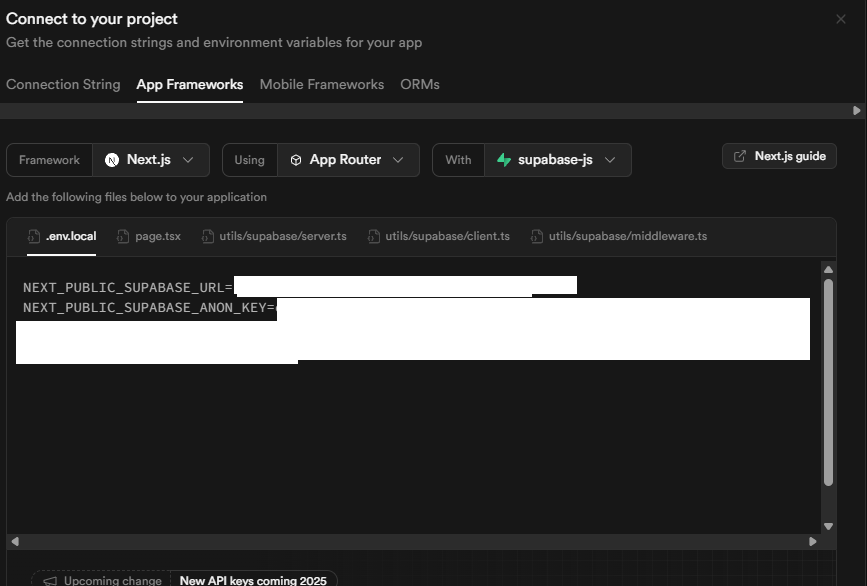

# チャプター2: DB接続 (Supabase)

## 1. このチャプターの目標

このチャプターでは、データベースを準備し、プロジェクトから接続できるようにします。具体的には以下のことができるようになるのが目標です。

- Supabaseというサービスを使って、新しいデータベースプロジェクトを作成する。
- Next.jsアプリとSupabaseデータベースを繋ぐための「鍵」となる情報を取得し、安全に保管する方法を学ぶ。
- Next.jsアプリ内でSupabaseとやり取りするための準備として、特別なプログラム（ユーティリティ）を作成する。

## 2. Supabaseプロジェクトと接続しよう

### 2.1. Supabaseプロジェクトの新規作成

まずはSupabaseのウェブサイトで、私たちのX-Cloneアプリ用のプロジェクトを作りましょう。

1.  **Supabase公式サイトにアクセス:** [Supabase](https://supabase.com/) を開き、アカウント登録またはログインします。
    
2.  **新しいプロジェクトを作成:** ダッシュボードで「New project」ボタンをクリックします。
    
3.  **組織を選択 (または作成):** 既存のOrganization（組織）を選ぶか、新しく作成します。
  
      **新しく作成するとき**
      
5.  **プロジェクト情報を入力:**
    - **Name:** プロジェクト名を入力します（例: `x-clone-tutorial`）。
    - **Database Password:** 強力なデータベースパスワードを生成するか、自分で設定します。**このパスワードは必ず安全な場所に控えておいてください。**
    - **Region:** プロジェクトのサーバーが存在する地域を選びます。基本 `Japan (Tokyo)` で良いでしょう。
    - **Pricing Plan:** 無料の `Free` プランを選択します。
    
6.  「Create new project」ボタンをクリックします。プロジェクトの準備が始まるので、数分待ちます。

### 3.2. API URLとanonキーの取得

プロジェクトの準備ができると、ダッシュボードが表示されます。

Next.jsアプリからこのSupabaseプロジェクトに接続するために必要な情報を取得します。

1.  上側のメニューから「Connect」（プラグのアイコン）を選び、その中の「App Frameworks」セクションに移動します。
    
2.  「.env.local」という項目の中に、以下の2つの重要な情報があります。
    - **URL (Project URL):** Supabaseプロジェクトの接続先アドレスです。
    - **anon key:** 匿名ユーザー（ログインしていないユーザーも含む）が安全に使えるAPIキーです。
      
    これらの値をコピーしておきます。

### 3.3. Next.jsプロジェクトに環境変数を設定

コピーしたSupabaseのURLとanonキーを、Next.jsプロジェクトに安全に設定します。

1.  VS Codeで `X-Clone` プロジェクトを開きます。
2.  プロジェクトのルートディレクトリ（`app` や `package.json` と同じ階層）に、`.env.local` という名前のファイルを新規作成します。
3.  `.env.local` ファイルに先ほどSupabaseからコピーした実際のURLとanonキーを記述してください。

4.  **`.gitignore` ファイルの確認:**
    プロジェクトルートにある `.gitignore` ファイルを開き、`.env*` という行が含まれていることを確認してください。これにより、この大事な情報が含まれるファイルが誤ってGitHubなどに公開されるのを防ぎます。

### 3.4. Supabaseクライアントユーティリティの作成

Supabaseとやり取りするための初期設定や関数をまとめた「ユーティリティ（便利道具）ファイル」を作成します。これにより、アプリの様々な場所から簡単にSupabaseの機能を利用できるようになります。

プロジェクトに `utils` フォルダを作成し、その中に `supabase` というフォルダを作り、その中に以下の2つのファイルを作成します。

```
X-Clone/
└── utils/
    └── supabase/
        ├── client.ts
        └── server.ts
```

#### 3.4.1. モジュールのインストール
サーバー側でDB操作をするためのモジュールをこのプロジェクトにインストールします。

```bash
npm install @supabase/ssr
```
#### 3.4.1. クライアントコンポーネント用 (`utils/supabase/client.ts`)

ブラウザ側で動作するコンポーネント（例: ユーザーの操作に応じて動的に見た目が変わる部分）からSupabaseを利用する際に使います。

```typescript
// utils/supabase/client.ts
import { createBrowserClient } from "@supabase/ssr";

export function createClient() {
  // 環境変数から Supabase の URL と Anon Key を取得してクライアントを作成
  return createBrowserClient(
    process.env.NEXT_PUBLIC_SUPABASE_URL!,
    process.env.NEXT_PUBLIC_SUPABASE_ANON_KEY!
  );
}

```

- `createBrowserClient` 関数を使って、ブラウザ環境用のSupabaseクライアントを作成します。
- `process.env.NEXT_PUBLIC_SUPABASE_URL` と `process.env.NEXT_PUBLIC_SUPABASE_ANON_KEY` で、`.env.local` に設定した値を取得しています。末尾の `!` は「この値は絶対に存在するはずだ」とTypeScriptに伝えるためのものです。

#### 3.4.2. サーバーコンポーネント・サーバーアクション・APIルート用 (`utils/supabase/server.ts`)

サーバー側で動作する処理（例: ページが読み込まれる前のデータ取得、APIエンドポイントの処理）からSupabaseを利用する際に使います。

```typescript
// utils/supabase/server.ts
// SupabaseのSSR（サーバーサイドレンダリング）用クライアントを作成する関数をインポート
import { createServerClient } from "@supabase/ssr";

// Next.jsのcookies関数をインポート（サーバー側でCookieにアクセスするために使用）
import { cookies } from "next/headers";

// Supabaseクライアントを作成する非同期関数
export async function createClient() {
  // Cookieストアを取得（ここで取得したCookieにセッション情報などが含まれる）
  const cookieStore = await cookies();

  // Supabaseクライアントを作成して返す
  return createServerClient(
    // SupabaseのURLと匿名キーを環境変数から取得
    process.env.NEXT_PUBLIC_SUPABASE_URL!,
    process.env.NEXT_PUBLIC_SUPABASE_ANON_KEY!,
    {
      // Cookieの読み書きを定義（Supabaseがセッション情報を扱うために使用）
      cookies: {
        // クライアントからすべてのCookieを取得する関数
        getAll() {
          return cookieStore.getAll();
        },
        // Supabaseが必要とするCookieをサーバーにセットする関数
        setAll(cookiesToSet) {
          try {
            // 取得したすべてのCookie情報をcookieStoreに書き込む
            cookiesToSet.forEach(({ name, value, options }) =>
              cookieStore.set(name, value, options)
            );
          } catch {
            // エラーが発生した場合（たとえばServer Componentで呼び出された場合など）、
            // 何もせずスルーする。ミドルウェアなどでセッションを更新している場合は問題ない。
          }
        },
      },
    }
  );
}

```

- `createServerClient` 関数を使って、サーバー環境用のSupabaseクライアントを作成します。
- ユーザーの認証状態を管理するためにクッキー (`cookies`) の処理が含まれています。

**これで、Next.jsプロジェクトからSupabaseに接続するための準備が整いました！**

実際にデータベースにデータを保存したり読み取ったりするのは、次のチャプター以降で行います。今はまず、エラーなくこれらのファイルが作成でき、開発サーバーが起動できることを確認しましょう。

---

お疲れ様でした！これでチャプター2は終了です。
次のチャプターでは、このデータベースを使ってユーザーが登録したりログインしたりする「認証」の仕組みを作っていきます。
