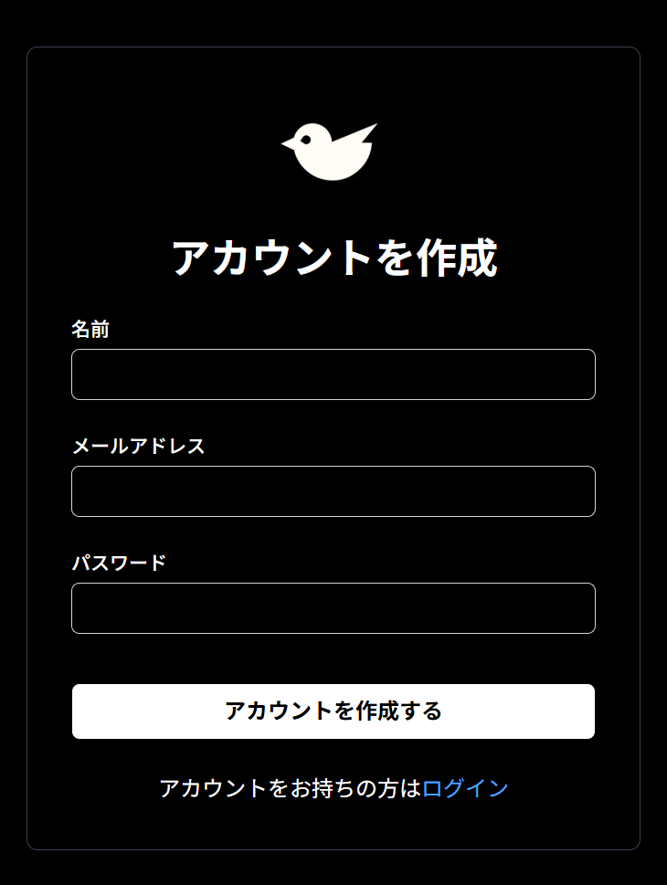
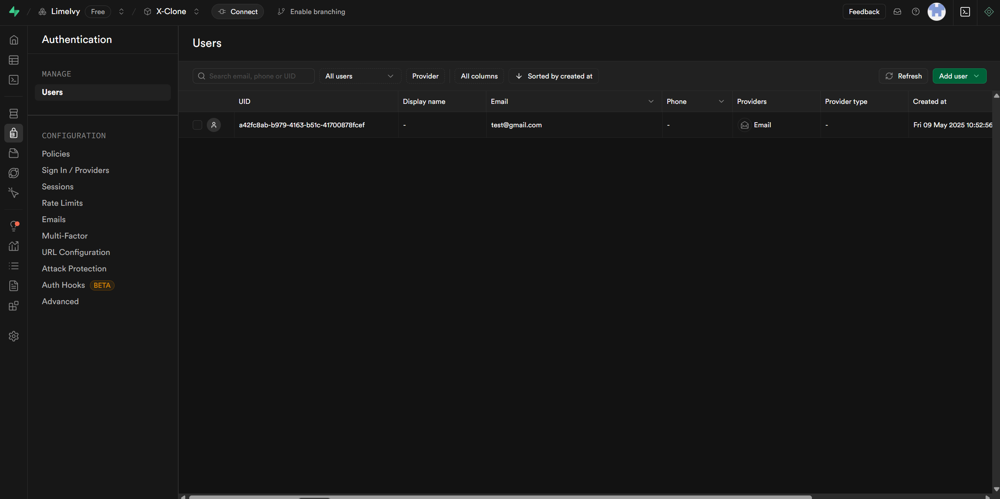
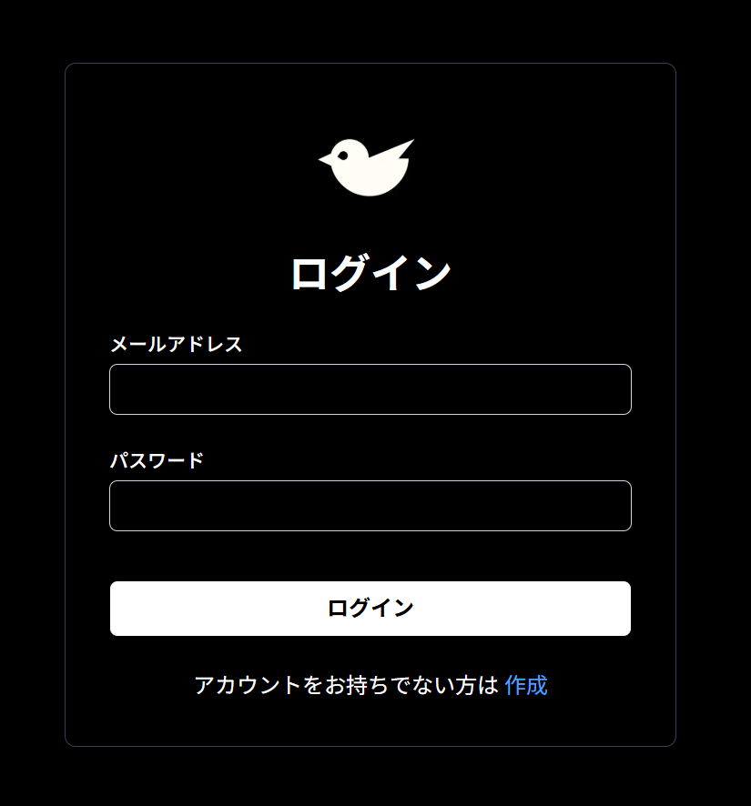

# チャプター3: 認証機能の実装 (Supabase Auth)

## 1. このチャプターの目標

このチャプターでは、X-Cloneアプリに「あなたは誰？」を識別し、ユーザーごとに異なる体験を提供するための第一歩となる「認証機能」を実装します。具体的には以下のことができるようになるのが目標です。

- 新しいユーザーがメールアドレスとパスワードを使ってアプリに登録できるようにする（新規登録）。
- 登録済みのユーザーがログインできるようにする（ログイン）。
- ログインしているユーザーがログアウトできるようにする（ログアウト）。
- ログインしていないと見れないページへのアクセスを制限する仕組み（Middleware）の基本を導入する。

## 2. 実装: 認証機能を一つずつ作ろう

### 2.1. Supabaseの認証設定を確認しよう

まず、Supabase側でメールアドレスとパスワードを使った認証が有効になっているか、また開発をスムーズに進めるための設定を確認します。

1.  **Supabaseプロジェクトダッシュボードを開く:** チャプター2で作成したSupabaseプロジェクトにアクセスします。
2.  **認証設定へ移動:** 左側のメニューから「Authentication」を選び、その中の「Providers」セクションに移動します。
    
3.  **Emailプロバイダーの確認:** 「Email」が有効 (Enabled) になっていることを確認します。通常はデフォルトで有効です。
    
4.  **メール確認を一時的に無効化 (開発用):**
    - 同じ「Providers」セクションの「Email」プロバイダーの設定を開きます（通常、トグルスイッチの隣にある設定アイコンやリンク）。
    - 「Confirm email」という項目のトグルスイッチを **オフ** にします。これにより、新規登録時に確認メールのステップを省略でき、開発中のテストが容易になります。
    - **注意:** 本番環境のアプリケーションでは、セキュリティのため「Confirm email」を有効にすることが強く推奨されます。
      
    - 設定を変更したら、忘れずに保存します。

### 3.2. ユーザー登録ページ (UI作成)

ユーザーがアカウントを作成するための入力フォームとページを作成します。
以下の場所に、**register**フォルダとpage.tsxを作成してください
```
X-Clone/
└── app/
    └── register/
        └── page.tsx
```

```tsx
// app/register/page.tsx
"use client";

import Image from "next/image";
import Link from "next/link";
import { useState } from "react";
import { createClient } from "@/utils/supabase/client";
import { useRouter } from "next/navigation";

export default function RegisterPage() {
  const [email, setEmail] = useState("");
  const [password, setPassword] = useState("");
  const [name, setName] = useState("");
  const router = useRouter();
  const supabase = createClient();

  const handleSubmit = async (e: React.FormEvent<HTMLFormElement>) => {
    e.preventDefault();

    const { error } = await supabase.auth.signUp({
      email: email,
      password: password,
      options: {
        data: {
          name: name,
        },
      },
    });

    if (error) {
      console.error("Error signing up:", error.message);
      alert(`登録エラー: ${error.message}`);
    } else {
      alert("登録が完了しました。");

      router.push("/");
      router.refresh();
    }
  };

  return (
    <div className="flex min-h-screen items-center justify-center bg-black">
      <div className="w-full max-w-md space-y-6 rounded-lg border border-gray-700 bg-black p-8 shadow-md">
        <Image
          src="/X.png"
          alt="logo"
          width={80}
          height={80}
          className="mx-auto"
        />
        <h2 className="text-center text-3xl font-bold text-white">
          アカウントを作成
        </h2>
        <form className="space-y-6" onSubmit={handleSubmit}>
          <div>
            <label
              htmlFor="name"
              className="block text-sm font-medium text-white"
            >
              名前
            </label>
            <input
              id="name"
              name="name"
              type="text"
              required
              className="mt-1 block w-full rounded-md border border-gray-300 px-3 py-2 text-white focus:border-blue-400 focus:outline-none sm:text-sm"
              value={name}
              onChange={(e) => setName(e.target.value)}
            />
          </div>
          <div>
            <label
              htmlFor="email"
              className="block text-sm font-medium text-white"
            >
              メールアドレス
            </label>
            <input
              id="email"
              name="email"
              type="email"
              required
              className="mt-1 block w-full rounded-md border border-gray-300 px-3 py-2 text-white focus:border-blue-400 focus:outline-none sm:text-sm"
              value={email}
              onChange={(e) => setEmail(e.target.value)}
            />
          </div>
          <div>
            <label
              htmlFor="password"
              className="block text-sm font-medium text-white"
            >
              パスワード
            </label>
            <input
              id="password"
              name="password"
              type="password"
              required
              className="mt-1 block w-full rounded-md border border-gray-300 px-3 py-2 text-white focus:border-blue-400 focus:outline-none sm:text-sm"
              value={password}
              onChange={(e) => setPassword(e.target.value)}
            />
          </div>
          <div className="flex items-center justify-center">
            <button
              type="submit"
              className="mt-3 w-full cursor-pointer rounded-md border bg-white py-2 font-semibold text-black hover:bg-gray-200 hover:shadow-lg"
            >
              アカウントを作成する
            </button>
          </div>
          <div className="flex items-center justify-center">
            <p className="text-white">アカウントをお持ちの方は</p>
            <Link
              href="/login"
              className="relative text-blue-400 after:absolute after:bottom-0 after:left-0 after:h-[1px] after:w-0 after:bg-blue-500 hover:after:w-full"
            >
              ログイン
            </Link>
          </div>
        </form>
      </div>
    </div>
  );
}

```

- **ポイント:**
  - `'use client';` をファイルの先頭に記述して、クライアントコンポーネントとしています。
  - `useState` で名前、メールアドレス、パスワードの状態を管理します。
  - `useRouter` で登録成功後のページ遷移を行います。
  - `createClient` でSupabaseクライアントを取得します。
  - `handleRegister` 関数で `supabase.auth.signUp` を呼び出し、ユーザー登録処理を行います。
    - `options.data` を使うと、`auth.users` テーブルの `raw_user_meta_data` カラムに任意の情報を保存できます。ここに名前を保存しておき、後述するDBトリガーで `profile` テーブル作成時に利用します。
  - エラーがあれば表示し、成功すればホームページにリダイレクトします。
  - `router.refresh()` は、リダイレクト後にサーバー側の状態（特に認証状態に関連するリダイレクトなど）を更新するために呼び出しています。

**このページが完成したら、http://localhost:3000/register**を開いてみましょう　以下のように表示されると思います。
### 完成後の写真
  

  **アカウントを作成すると、画面に「登録が完了しました。」と表示され、http://localhost:3000 に移動すると思います。**

  **また、Supabaseの画面にもユーザーが追加されているのが確認できるはずです。**

  

### 3.3. ログインページ (UI作成)

登録済みのユーザーがログインするためのページを作成します。

- **ファイルパス:** `app/login/page.tsx` (まだなければ新規作成)

```tsx
// app/login/page.tsx
"use client";

import Image from "next/image";
import Link from "next/link";
import { useState } from "react";
import { createClient } from "@/utils/supabase/client";
import { useRouter } from "next/navigation";

export default function LoginPage() {
  const [email, setEmail] = useState("");
  const [password, setPassword] = useState("");
  const router = useRouter();
  const supabase = createClient();

  const handleSubmit = async (e: React.FormEvent<HTMLFormElement>) => {
    e.preventDefault();

    const { data, error } = await supabase.auth.signInWithPassword({
      email: email,
      password: password,
    });

    if (error) {
      console.error("Error signing in:", error.message);
      alert(`ログインエラー: ${error.message}`);
    } else {
      console.log("Sign in successful:", data);
      alert("ログインしました。");

      router.push("/");
      router.refresh();
    }
  };

  return (
    <div className="flex min-h-screen items-center justify-center bg-black">
      <div className="w-full max-w-md space-y-6 rounded-lg border border-gray-700 bg-black p-8 shadow-md">
        <Image
          src="/X.png"
          alt="logo"
          width={80}
          height={80}
          className="mx-auto"
        />
        <h2 className="text-center text-3xl font-bold text-white">ログイン</h2>
        <form className="space-y-6" onSubmit={handleSubmit}>
          <div>
            <label
              htmlFor="email"
              className="block text-sm font-medium text-white"
            >
              メールアドレス
            </label>
            <input
              id="email"
              name="email"
              type="email"
              required
              className="mt-1 block w-full rounded-md border border-gray-300 bg-black px-3 py-2 text-white focus:border-blue-400 focus:outline-none sm:text-sm"
              value={email}
              onChange={(e) => setEmail(e.target.value)}
            />
          </div>
          <div>
            <label
              htmlFor="password"
              className="block text-sm font-medium text-white"
            >
              パスワード
            </label>
            <input
              id="password"
              name="password"
              type="password"
              required
              className="mt-1 block w-full rounded-md border border-gray-300 bg-black px-3 py-2 text-white focus:border-blue-400 focus:outline-none sm:text-sm"
              value={password}
              onChange={(e) => setPassword(e.target.value)}
            />
          </div>
          <div className="flex items-center justify-center">
            <button
              type="submit"
              className="mt-3 w-full cursor-pointer rounded-md border bg-white py-2 font-semibold text-black hover:bg-gray-200 hover:shadow-lg"
            >
              ログイン
            </button>
          </div>
          <div className="flex items-center justify-center">
            <p className="mr-1 text-white">アカウントをお持ちでない方は</p>
            <Link
              href="/register"
              className="relative text-blue-400 after:absolute after:bottom-0 after:left-0 after:h-[1px] after:w-0 after:bg-blue-500 hover:after:w-full"
            >
              作成
            </Link>
          </div>
        </form>
      </div>
    </div>
  );
}

```

- **ポイント:**
  - `handleLogin` 関数で `supabase.auth.signInWithPassword` を呼び出してログイン処理を行います。
  - 成功すればホームページにリダイレクトします。

**このページが完成したら、http://localhost:3000/login**を開いてみましょう。以下のように表示されると思います。

### 完成後の写真


**まだログアウトが出来ないので、ログインしようとするとエラーが出るかもしれません。とりあえず次に進みましょう。**

### 3.4. ログアウト機能の実装

アプリからログアウトするためのボタンと処理を追加します。
左サイドバーにログアウトボタンを設置します。

- **ファイルパス:** `components/sidebar/LeftSidebar.tsx` を編集します。

```tsx
// components/sidebar/LeftSidebar.tsx
"use client";
import { Bell, Home, MoreHorizontal, Search, User } from "lucide-react";
import Image from "next/image";
import Link from "next/link";
import React, { useState, useRef, useEffect } from "react";
import { myProfile } from "@/data/profile";
import { useRouter } from "next/navigation";
import { createClient } from "@/utils/supabase/client";

export const LeftSidebar = () => {
  const [showMenu, setShowMenu] = useState(false);
  const menuRef = useRef<HTMLDivElement>(null);
  const buttonRef = useRef<HTMLButtonElement>(null);
  const router = useRouter();
  const supabase = createClient();

  // ログアウト処理の追加
  const handleLogout = async () => {
    const { error } = await supabase.auth.signOut();

    if (error) {
      console.error("Error logging out:", error.message);
      alert(`ログアウトエラー: ${error.message}`);
    } else {
      console.log("Logged out successfully");
      alert("ログアウトしました。");
      router.push("/login");
      router.refresh();
    }
  };
  // 外側クリック検出のための関数
  useEffect(() => {
    const handleOutsideClick = (event: MouseEvent) => {
      if (
        menuRef.current &&
        buttonRef.current &&
        !menuRef.current.contains(event.target as Node) &&
        !buttonRef.current.contains(event.target as Node)
      ) {
        setShowMenu(false);
      }
    };

    // イベントリスナーの登録
    document.addEventListener("mousedown", handleOutsideClick);

    // クリーンアップ関数
    return () => {
      document.removeEventListener("mousedown", handleOutsideClick);
    };
  }, []);

  return (
    <div className="sticky top-0 h-screen text-white">
      <div className="bg-black h-full w-full flex flex-col justify-between border-r border-gray-800">
        <div className="flex flex-col gap-2">
          {/* ロゴ */}
          <Link href="/" className="w-full h-12 p-4">
            <Image src="/X.png" alt="logo" width={40} height={40} />
          </Link>
          {/* ホーム */}
          <Link href="/" className="mt-10 px-2 flex rounded-full">
            <div className="flex items-center hover:bg-gray-900 rounded-full px-4 py-3">
              <Home />
              <p className="ml-3 hidden lg:block">ホーム</p>
            </div>
          </Link>
          {/* 話題を検索 */}
          <Link href="/explore" className="px-2 flex rounded-full">
            <div className="flex items-center hover:bg-gray-900 rounded-full px-4 py-3">
              <Search />
              <p className="ml-3 hidden lg:block">話題を検索</p>
            </div>
          </Link>
          {/* 通知 */}
          <Link href="/notifications" className="px-2 flex rounded-full">
            <div className="flex items-center hover:bg-gray-900 rounded-full px-4 py-3">
              <Bell />
              <p className="ml-3 hidden lg:block">通知</p>
            </div>
          </Link>
          {/* プロフィール */}
          <Link href="/profile" className="px-2 flex rounded-full">
            <div className="flex items-center hover:bg-gray-900 rounded-full px-4 py-3">
              <User />
              <p className="ml-3 hidden lg:block">プロフィール</p>
            </div>
          </Link>
        </div>
        {/* アカウント */}
        <div className="px-3 mb-3 relative">
          <button
            ref={buttonRef}
            className="w-full flex items-center justify-between p-3 hover:bg-gray-800 rounded-full"
            onClick={() => setShowMenu(!showMenu)}
          >
            <div className="flex items-center">
              <div className="mr-4">
                <div className="w-8 h-8 rounded-full bg-gray-600"></div>
              </div>
              <div className="text-left hidden lg:block">
                <p className="font-bold text-sm">{myProfile.name}</p>
                <p className="text-gray-500 text-xs">@{myProfile.userId}</p>
              </div>
            </div>
            <MoreHorizontal size={18} className="text-white hidden lg:block" />
          </button>

          {/* アカウントメニュー */}
          {showMenu && (
            <div
              ref={menuRef}
              className="absolute bottom-full left-3 mb-2 w-60 bg-black rounded-xl shadow-lg border border-gray-800 overflow-hidden z-50 hover:bg-gray-900"
            >
              <button className="p-4 cursor-pointer text-white" onClick={handleLogout}>
                @{myProfile.userId}からログアウト
              </button>
            </div>
          )}
        </div>
      </div>
    </div>
  );
};
```

**このページが完成したら、左サイドバー下部から、「@aaaからログアウト」というボタンを押すと、「ログアウトしました。」と表示されると思います。**

**また、ログインもできるか確認しておきましょう**

---

お疲れ様でした！これでチャプター3は終了です。
次のチャプターでは、データベースにユーザの詳細なデータを保存する場所を作り、プロフィールを正しく表示できるようにします。