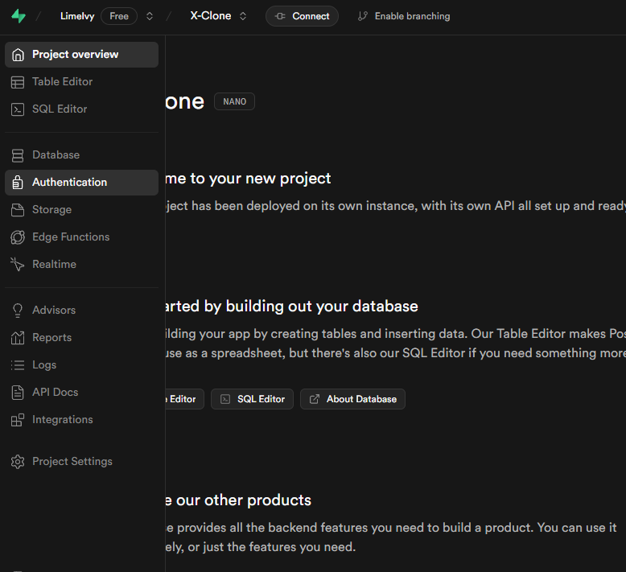
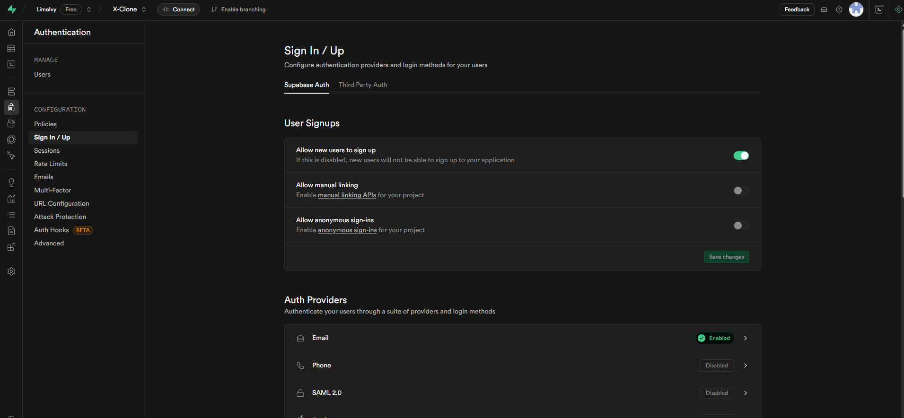
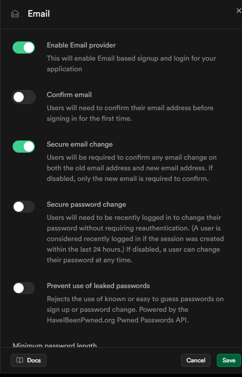

# チャプター3: 認証機能の実装 (Supabase Auth)

## 1. このチャプターの目標

このチャプターでは、X-Cloneアプリに「あなたは誰？」を識別し、ユーザーごとに異なる体験を提供するための第一歩となる「認証機能」を実装します。具体的には以下のことができるようになるのが目標です。

- 新しいユーザーがメールアドレスとパスワードを使ってアプリに登録できるようにする（新規登録）。
- 登録済みのユーザーがログインできるようにする（ログイン）。
- ログインしているユーザーがログアウトできるようにする（ログアウト）。
- ログインしていないと見れないページへのアクセスを制限する仕組み（Middleware）の基本を導入する。

## 2. 実装: 認証機能を一つずつ作ろう

### 2.1. Supabaseの認証設定を確認しよう

まず、Supabase側でメールアドレスとパスワードを使った認証が有効になっているか、また開発をスムーズに進めるための設定を確認します。

1.  **Supabaseプロジェクトダッシュボードを開く:** チャプター2で作成したSupabaseプロジェクトにアクセスします。
2.  **認証設定へ移動:** 左側のメニューから「Authentication」を選び、その中の「Providers」セクションに移動します。
    
3.  **Emailプロバイダーの確認:** 「Email」が有効 (Enabled) になっていることを確認します。通常はデフォルトで有効です。
    
4.  **メール確認を一時的に無効化 (開発用):**
    - 同じ「Providers」セクションの「Email」プロバイダーの設定を開きます（通常、トグルスイッチの隣にある設定アイコンやリンク）。
    - 「Confirm email」という項目のトグルスイッチを **オフ** にします。これにより、新規登録時に確認メールのステップを省略でき、開発中のテストが容易になります。
    - **注意:** 本番環境のアプリケーションでは、セキュリティのため「Confirm email」を有効にすることが強く推奨されます。
      
    - 設定を変更したら、忘れずに保存します。

### 3.2. ユーザー登録ページ (UI作成)

ユーザーがアカウントを作成するための入力フォームとページを作成します。

- **ファイルパス:** `app/register/page.tsx` (まだなければ新規作成)

```tsx
// app/register/page.tsx
"use client";

import Image from "next/image";
import Link from "next/link";
import { useState } from "react";
import { createClient } from "@/utils/supabase/client";
import { useRouter } from "next/navigation";

export default function RegisterPage() {
  const [email, setEmail] = useState("");
  const [password, setPassword] = useState("");
  const [name, setName] = useState("");
  const router = useRouter();
  const supabase = createClient();

  const handleSubmit = async (e: React.FormEvent<HTMLFormElement>) => {
    e.preventDefault();

    const { data, error } = await supabase.auth.signUp({
      email: email,
      password: password,
      options: {
        data: {
          name: name,
        },
      },
    });

    if (error) {
      console.error("Error signing up:", error.message);
      alert(`登録エラー: ${error.message}`);
    } else {
      console.log("Sign up successful:", data);
      alert("登録が完了しました。");

      router.push("/");
      router.refresh();
    }
  };

  return (
    <div className="flex min-h-screen items-center justify-center bg-black">
      <div className="w-full max-w-md space-y-6 rounded-lg border border-gray-700 bg-black p-8 shadow-md">
        <Image
          src="/X.png"
          alt="logo"
          width={80}
          height={80}
          className="mx-auto"
        />
        <h2 className="text-center text-3xl font-bold text-white">
          アカウントを作成
        </h2>
        <form className="space-y-6" onSubmit={handleSubmit}>
          <div>
            <label
              htmlFor="name"
              className="block text-sm font-medium text-white"
            >
              名前
            </label>
            <input
              id="name"
              name="name"
              type="text"
              required
              className="mt-1 block w-full rounded-md border border-gray-300 px-3 py-2 text-white focus:border-blue-400 focus:outline-none sm:text-sm"
              value={name}
              onChange={(e) => setName(e.target.value)}
            />
          </div>
          <div>
            <label
              htmlFor="email"
              className="block text-sm font-medium text-white"
            >
              メールアドレス
            </label>
            <input
              id="email"
              name="email"
              type="email"
              required
              className="mt-1 block w-full rounded-md border border-gray-300 px-3 py-2 text-white focus:border-blue-400 focus:outline-none sm:text-sm"
              value={email}
              onChange={(e) => setEmail(e.target.value)}
            />
          </div>
          <div>
            <label
              htmlFor="password"
              className="block text-sm font-medium text-white"
            >
              パスワード
            </label>
            <input
              id="password"
              name="password"
              type="password"
              required
              className="mt-1 block w-full rounded-md border border-gray-300 px-3 py-2 text-white focus:border-blue-400 focus:outline-none sm:text-sm"
              value={password}
              onChange={(e) => setPassword(e.target.value)}
            />
          </div>
          <div className="flex items-center justify-center">
            <button
              type="submit"
              className="mt-3 w-full cursor-pointer rounded-md border bg-white py-2 font-semibold text-black hover:bg-gray-200 hover:shadow-lg"
            >
              アカウントを作成する
            </button>
          </div>
          <div className="flex items-center justify-center">
            <p className="text-white">アカウントをお持ちの方は</p>
            <Link
              href="/login"
              className="relative text-blue-400 after:absolute after:bottom-0 after:left-0 after:h-[1px] after:w-0 after:bg-blue-500 hover:after:w-full"
            >
              ログイン
            </Link>
          </div>
        </form>
      </div>
    </div>
  );
}

```

- **ポイント:**
  - `'use client';` をファイルの先頭に記述して、クライアントコンポーネントとしています。
  - `useState` で名前、メールアドレス、パスワードの状態を管理します。
  - `useRouter` で登録成功後のページ遷移を行います。
  - `createClient` でSupabaseクライアントを取得します。
  - `handleRegister` 関数で `supabase.auth.signUp` を呼び出し、ユーザー登録処理を行います。
    - `options.data` を使うと、`auth.users` テーブルの `raw_user_meta_data` カラムに任意の情報を保存できます。ここに名前を保存しておき、後述するDBトリガーで `profile` テーブル作成時に利用します。
  - エラーがあれば表示し、成功すればホームページにリダイレクトします。
  - `router.refresh()` は、リダイレクト後にサーバー側の状態（特に認証状態に関連するリダイレクトなど）を更新するために呼び出しています。

（画像イメージ: `../../資料/2. 認証/2.png` - 作成した新規登録ページのスクリーンショット）

### 3.3. ログインページ (UI作成)

登録済みのユーザーがログインするためのページを作成します。

- **ファイルパス:** `app/login/page.tsx` (まだなければ新規作成)

```tsx
// app/login/page.tsx
"use client";

import Image from "next/image";
import Link from "next/link";
import { useState } from "react";
import { createClient } from "@/utils/supabase/client";
import { useRouter } from "next/navigation";

export default function LoginPage() {
  const [email, setEmail] = useState("");
  const [password, setPassword] = useState("");
  const router = useRouter();
  const supabase = createClient();

  const handleSubmit = async (e: React.FormEvent<HTMLFormElement>) => {
    e.preventDefault();

    const { data, error } = await supabase.auth.signInWithPassword({
      email: email,
      password: password,
    });

    if (error) {
      console.error("Error signing in:", error.message);
      alert(`ログインエラー: ${error.message}`);
    } else {
      console.log("Sign in successful:", data);
      alert("ログインしました。");

      router.push("/");
      router.refresh();
    }
  };

  return (
    <div className="flex min-h-screen items-center justify-center bg-black">
      <div className="w-full max-w-md space-y-6 rounded-lg border border-gray-700 bg-black p-8 shadow-md">
        <Image
          src="/X.png"
          alt="logo"
          width={80}
          height={80}
          className="mx-auto"
        />
        <h2 className="text-center text-3xl font-bold text-white">ログイン</h2>
        <form className="space-y-6" onSubmit={handleSubmit}>
          <div>
            <label
              htmlFor="email"
              className="block text-sm font-medium text-white"
            >
              メールアドレス
            </label>
            <input
              id="email"
              name="email"
              type="email"
              required
              className="mt-1 block w-full rounded-md border border-gray-300 bg-black px-3 py-2 text-white focus:border-blue-400 focus:outline-none sm:text-sm"
              value={email}
              onChange={(e) => setEmail(e.target.value)}
            />
          </div>
          <div>
            <label
              htmlFor="password"
              className="block text-sm font-medium text-white"
            >
              パスワード
            </label>
            <input
              id="password"
              name="password"
              type="password"
              required
              className="mt-1 block w-full rounded-md border border-gray-300 bg-black px-3 py-2 text-white focus:border-blue-400 focus:outline-none sm:text-sm"
              value={password}
              onChange={(e) => setPassword(e.target.value)}
            />
          </div>
          <div className="flex items-center justify-center">
            <button
              type="submit"
              className="mt-3 w-full cursor-pointer rounded-md border bg-white py-2 font-semibold text-black hover:bg-gray-200 hover:shadow-lg"
            >
              ログイン
            </button>
          </div>
          <div className="flex items-center justify-center">
            <p className="mr-1 text-white">アカウントをお持ちでない方は</p>
            <Link
              href="/register"
              className="relative text-blue-400 after:absolute after:bottom-0 after:left-0 after:h-[1px] after:w-0 after:bg-blue-500 hover:after:w-full"
            >
              作成
            </Link>
          </div>
        </form>
      </div>
    </div>
  );
}

```

- **ポイント:**
  - 登録ページとほぼ同様の構成です。
  - `handleLogin` 関数で `supabase.auth.signInWithPassword` を呼び出してログイン処理を行います。
  - 成功すればホームページにリダイレクトします。

（画像イメージ: `../../資料/2. 認証/3.png` - 作成したログインページのスクリーンショット）

### 3.4. ログアウト機能の実装

アプリからログアウトするためのボタンと処理を追加します。
ここでは仮として、左サイドバーにログアウトボタンを設置します。

- **ファイルパス:** `components/sidebar/LeftSidebar.tsx` (なければ新規作成、または既存のものを修正)

```tsx
// components/sidebar/LeftSidebar.tsx
"use client";

import { useRouter } from 'next/navigation';
import { createClient } from '@/utils/supabase/client';
// 他に必要なインポートがあれば追加 (例: Link, ユーザー情報表示用フックなど)

export function LeftSidebar() {
  const router = useRouter();
  const supabase = createClient();

  const handleLogout = async () => {
    const { error } = await supabase.auth.signOut();
    if (error) {
      console.error('Error logging out:', error.message);
      alert('ログアウトに失敗しました。');
      return;
    }
    alert('ログアウトしました。');
    router.push('/login'); // ログインページへリダイレクト
    router.refresh();
  };

  // ログイン状態によって表示を変える場合は、ここでユーザー情報を取得するロジックが必要になります。
  // 例えば、useEffect と useState を使ってユーザー情報を保持し、
  // ユーザーがいればプロフィール情報やログアウトボタンを、いなければログイン/登録リンクを表示するなど。
  // このチャプターではまずログアウト機能の実装に集中します。

  return (
    <aside className="h-screen w-64 bg-gray-800 p-4 text-white fixed top-0 left-0">
      <nav>
        <ul>
          <li className="mb-2">
            <a href="/" className="hover:text-blue-300">ホーム</a>
          </li>
          {/* 他のナビゲーションリンク */}
        </ul>
      </nav>

      {/* ログアウトボタン (仮) */}
      <div className="absolute bottom-4 left-4 right-4">
        <button
          onClick={handleLogout}
          className="w-full bg-red-600 hover:bg-red-700 text-white font-bold py-2 px-4 rounded focus:outline-none focus:shadow-outline transition duration-150"
        >
          ログアウト
        </button>
      </div>
    </aside>
  );
}
```

- **ポイント:**
  - `handleLogout` 関数で `supabase.auth.signOut()` を呼び出してログアウトします。
  - 成功後、ログインページにリダイレクトします。
  - この `LeftSidebar` コンポーネントを、アプリ全体のレイアウトファイル (`app/layout.tsx`) で読み込んで表示するようにします。

**`app/layout.tsx` での `LeftSidebar` の組み込み例:**

```tsx
// app/layout.tsx
import type { Metadata } from "next";
import { Inter } from "next/font/google";
import "./globals.css";
import { LeftSidebar } from "@/components/sidebar/LeftSidebar"; // パスは適宜調整

const inter = Inter({ subsets: ["latin"] });

export const metadata: Metadata = {
  title: "X-Clone",
  description: "X-Clone by Next.js",
};

export default function RootLayout({
  children,
}: Readonly<{
  children: React.ReactNode;
}>) {
  return (
    <html lang="ja">
      <body className={`${inter.className} bg-gray-900 flex`}>
        <LeftSidebar />
        <main className="flex-1 p-4 ml-64"> {/* ml-64 はサイドバーの幅に合わせる */}
          {children}
        </main>
      </body>
    </html>
  );
}
```
