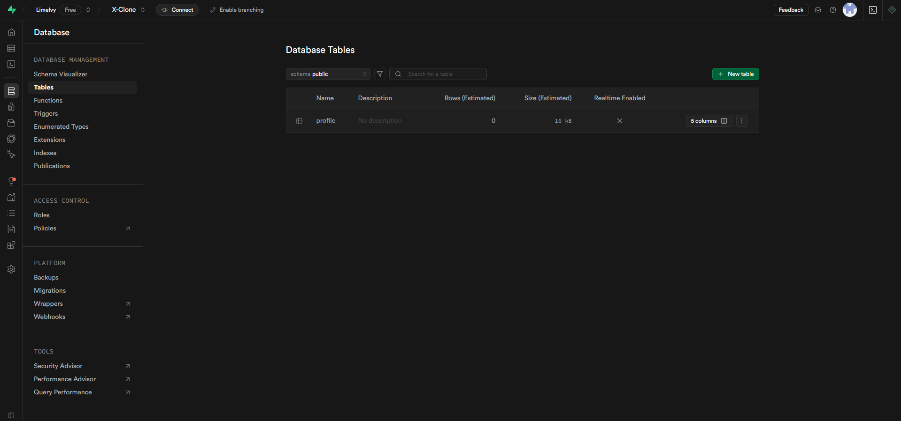
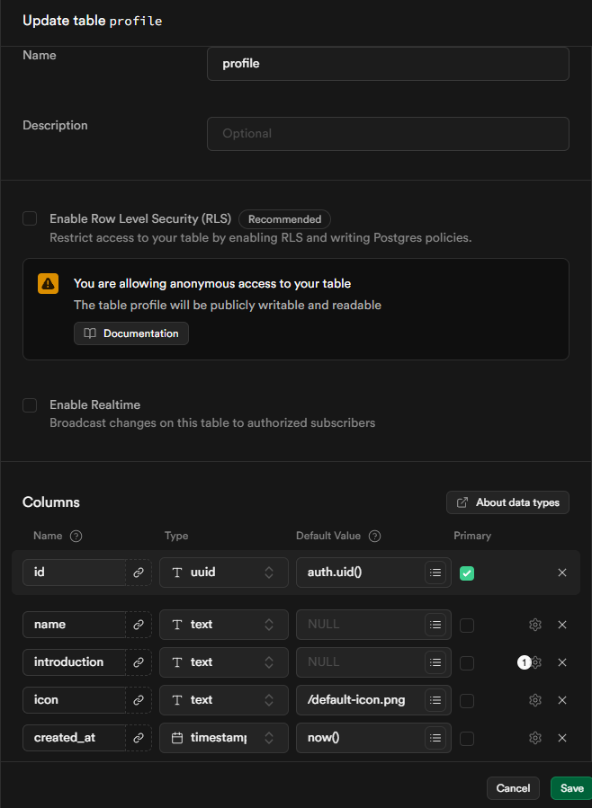
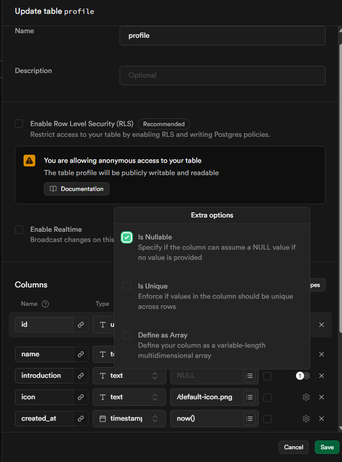
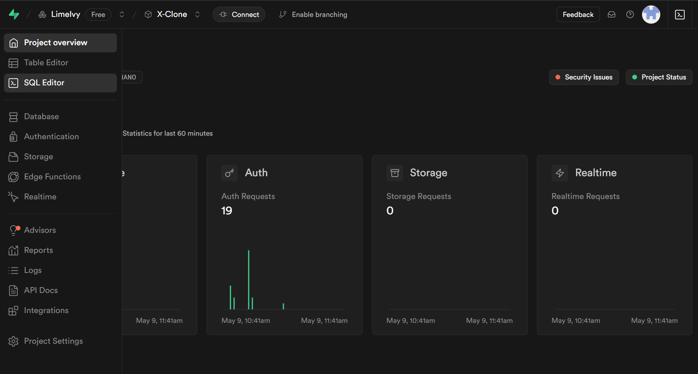
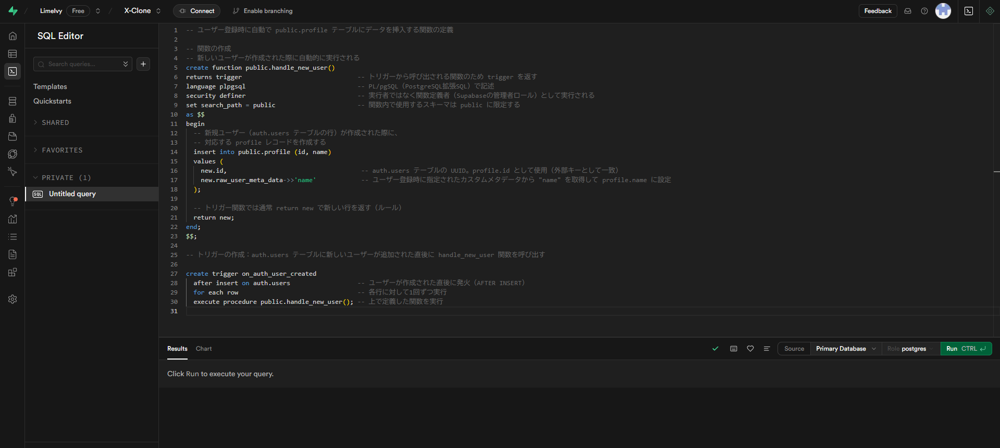
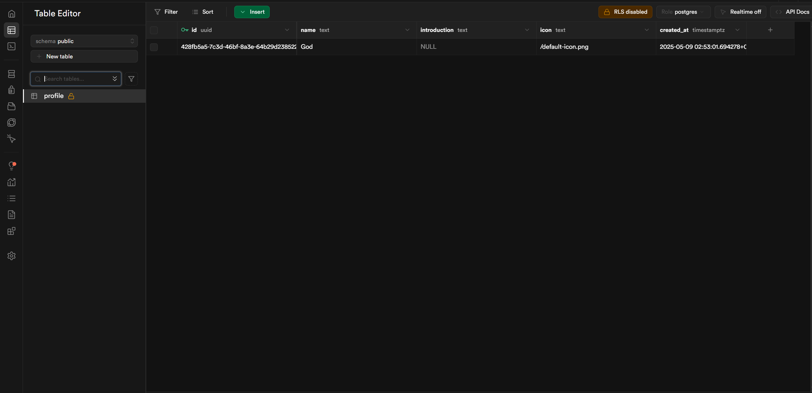

# チャプター4: プロフィール機能の実装

## 1. このチャプターの目標

このチャプターでは、ユーザーが自身の情報を表示・編集できるプロフィール機能と、プロフィールアイコンのアップロード機能を実装します。具体的には以下のことができるようになるのが目標です。

-   ユーザーごとのプロフィールページを表示する。
-   ログインユーザーが自身のプロフィール情報（名前、自己紹介）を編集できるようにする。
-   ユーザーがプロフィールアイコンをアップロードし、表示できるようにする。
-   Supabaseのデータベースに`profiles`テーブルを作成し、ユーザ情報を管理する。

## 2. Supabaseの準備: `profiles`テーブルとRLS、Storageの設定

認証機能で作成された`auth.users`テーブルには、メールアドレスや最終ログイン日時などの基本的な認証情報が保存されます。しかし、ユーザー名（表示名）、自己紹介、アバター画像のURLといった、アプリケーション固有のユーザー情報を保存するには、別途テーブルが必要です。

### 2.1. `profiles`テーブルの作成

1.  **Supabaseプロジェクトダッシュボードを開く:** 左側のメニューから「Table Editor」を選び、「Create a new table」をクリックします。
   
   

2.  テーブルにカラムを追加します。
   
    

3. 自己紹介文は無くてもいいので、以下の画像のようにintroductionカラムの右側の歯車アイコンを押し、**Is　Nullable**のチェックを入れておきます。逆に名前とアイコンは必須にしたいので、**Is　Nullable**のチェックを外しましょう。

    

4.  「Save」をクリックしてテーブルを作成します。

### 2.2. `profiles`テーブルへ自動登録させる

チャプター3でユーザー登録時にSupabaseにidと名前、Eメール等を保存しました。これを利用して、`auth.users`テーブルに新しいユーザーが追加された際に、自動的に`profiles`テーブルにも対応するレコードを作成するDB関数とトリガーを設定します。

1.  Supabaseダッシュボードの左メニューから「SQL Editor」を選択します。
    
2.  コードが入力できる欄があると思うので」、以下のSQLを入力します。

    ```sql
    -- ユーザー登録時に自動で public.profile テーブルにデータを挿入する関数の定義

    -- 関数の作成
    -- 新しいユーザーが作成された際に自動的に実行される
    create function public.handle_new_user()
    returns trigger                               -- トリガーから呼び出される関数のため trigger を返す
    language plpgsql                              -- PL/pgSQL（PostgreSQL拡張SQL）で記述
    security definer                              -- 実行者ではなく関数定義者（Supabaseの管理者ロール）として実行される
    set search_path = public                      -- 関数内で使用するスキーマは public に限定する
    as $$
    begin
      -- 新規ユーザー（auth.users テーブルの行）が作成された際に、
      -- 対応する profile レコードを作成する
      insert into public.profile (id, name)
      values (
        new.id,                                    -- auth.users テーブルの UUID。profile.id として使用（外部キーとして一致）
        new.raw_user_meta_data->>'name'            -- ユーザー登録時に指定されたカスタムメタデータから "name" を取得して profile.name に設定
      );

      -- トリガー関数では通常 return new で新しい行を返す（ルール）
      return new;
    end;
    $$;

    -- トリガーの作成：auth.users テーブルに新しいユーザーが追加された直後に handle_new_user 関数を呼び出す

    create trigger on_auth_user_created
      after insert on auth.users                  -- ユーザーが作成された直後に発火（AFTER INSERT）
      for each row                                -- 各行に対して1回ずつ実行
      execute procedure public.handle_new_user(); -- 上で定義した関数を実行
    ();
    ```

  

3.  右下近くにある「Run」をクリックして関数とトリガーを作成します。
   **「Success. No rows returned」**と出たら成功です！

4. 新しいユーザを作成したとき、Supabaseの左サイドバーにある**Table Editor -> profile**にユーザが追加されていたら成功です！



## 3. プロフィールページの表示 (UI作成)

各ユーザーのプロフィール情報（名前、自己紹介、アイコンなど）を表示する専用ページを作成します。URLは `/ユーザーID` の形式になります。
現在、`app/profile/page.tsx`にプロフィールを表示していますが、後々自分以外のプロフィールも表示させるため、1人1人URLを変えたいです。ここで、**動的ルーティング**というものを使います

**ファイルパス:** `app/[userId]/page.tsx` を新規作成します。
  
**`/[〇〇]`**として、〇〇の部分に一意(被らない)の値を入れることで、1人1人違ったプロフィール画面を表示させることが出来ます
  ```
  X-Clone/
  └── app/
      └── [userId]/  
          └── page.tsx　<- このフォルダを新規作成
  ```

```tsx
// app/[userId]/page.tsx
import { createClient } from "@/utils/supabase/server";
import Image from "next/image";
import { notFound } from "next/navigation";
import { Database } from "@/lib/database.types"; // Supabaseの型定義 (npx supabase gen types typescript --project-id <YOUR-PROJECT-ID> --schema public > lib/database.types.ts で生成)

type Profile = Database["public"]["Tables"]["profiles"]["Row"];

async function getProfile(userId: string): Promise<Profile | null> {
  const supabase = createClient(); // サーバーサイド用のSupabaseクライアント
  const { data, error } = await supabase
    .from("profiles")
    .select("*")
    .eq("user_id", userId)
    .single();

  if (error && error.code !== "PGRST116") { // PGRST116: row not found (許容)
    console.error("Error fetching profile:", error?.message);
    // notFound() をここで呼ぶか、呼び出し元で処理するかは設計次第
  }
  if (!data) {
      return null;
  }
  return data;
}

async function getAvatarPublicUrl(avatarPath: string | null): Promise<string | null> {
  if (!avatarPath) return null;
  const supabase = createClient();
  const { data } = supabase.storage.from("avatars").getPublicUrl(avatarPath);
  return data?.publicUrl || null;
}

export default async function UserProfilePage({
  params,
}: {
  params: { userId: string };
}) {
  const profile = await getProfile(params.userId);

  if (!profile) {
    notFound(); // プロフィールが見つからない場合は404ページを表示
  }

  const avatarPublicUrl = await getAvatarPublicUrl(profile.avatar_url);

  return (
    <div className="container mx-auto p-4 text-white">
      <div className="bg-gray-800 p-6 rounded-lg shadow-md max-w-2xl mx-auto">
        <div className="flex flex-col items-center sm:flex-row sm:items-start space-y-4 sm:space-y-0 sm:space-x-6 mb-6">
          {avatarPublicUrl ? (
            <Image
              src={avatarPublicUrl}
              alt={`${profile.name || params.userId}'s avatar`}
              width={128} // サイズ調整
              height={128} // サイズ調整
              className="rounded-full object-cover border-2 border-gray-600"
              priority // LCPを意識する場合
            />
          ) : (
            <div className="w-32 h-32 rounded-full bg-gray-700 flex items-center justify-center text-4xl text-gray-400 border-2 border-gray-600">
              {profile.name ? profile.name.charAt(0).toUpperCase() : params.userId.charAt(0).toUpperCase()}
            </div>
          )}
          <div className="text-center sm:text-left flex-grow">
            <h1 className="text-3xl font-bold">
              {profile.name || "名無しさん"}
            </h1>
            <p className="text-gray-400 text-sm">@{params.userId}</p>
            {/* プロフィール編集ページへのリンク (自分のプロフィールの場合のみ表示) */}
            {/* この部分は別途、ログインユーザーIDと表示中プロフィールのユーザーIDを比較するロジックが必要 */}
            {/* <Link href="/profile/edit" className="text-blue-400 hover:underline mt-2 inline-block">プロフィールを編集</Link> */}
          </div>
        </div>
        <div className="mt-4">
          <h2 className="text-xl font-semibold mb-2 border-b border-gray-700 pb-1">自己紹介</h2>
          <p className="text-gray-300 whitespace-pre-wrap min-h-[50px]">
            {profile.bio || "自己紹介がありません。"}
          </p>
        </div>
        {/* 今後、ここに投稿一覧などを表示することも可能 */}
      </div>
    </div>
  );
}
```

- **ポイント:**
    - `app/[userId]/page.tsx` は動的ルートセグメントを利用しています。`params.userId` でURLのユーザーIDを取得できます。
    - `getProfile` 関数でSupabaseから`profiles`テーブルの情報を`user_id`をキーに取得します。
    - `getAvatarPublicUrl` でStorageからアバター画像の公開URLを取得します。
    - プロフィールが存在しない場合は `notFound()` を呼び出して404ページを表示します。
    - `next/image` を使ってアバター画像を表示します。`avatar_url` がない場合は代替表示をします。
    - サーバーコンポーネントとして実装されているため、データ取得はサーバーサイドで行われます。
    - 型定義ファイル `lib/database.types.ts` は、Supabase CLIを使って生成することを推奨します。
      コマンド例: `npx supabase gen types typescript --project-id YOUR_PROJECT_ID --schema public > lib/database.types.ts`
    - 実際の運用では、ローディング状態の表示や、より詳細なエラーハンドリングを検討してください。

**このページが完成したら、例えば `/register` で作成したユーザーのID (Supabaseの `auth.users` テーブルで確認可能) を使って、`http://localhost:3000/取得したユーザーID` にアクセスしてみましょう。** (例: `http://localhost:3000/xxxxxxxx-xxxx-xxxx-xxxx-xxxxxxxxxxxx`)

### 完成後のイメージ (表示)
  *(ここにプロフィール表示ページのスクリーンショットのイメージを記述または画像パスを挿入。例: ``)*


## 4. プロフィール編集機能 (UI作成)

ログインしているユーザーが自身のプロフィール情報（名前、自己紹介、アイコン）を編集できるページを作成します。

- **ファイルパス:** `app/profile/edit/page.tsx` を新規作成します。
  ```
  X-Clone/
  └── app/
      └── profile/      <- このフォルダを新規作成
          └── edit/     <- このフォルダを新規作成
              └── page.tsx
  ```

```tsx
// app/profile/edit/page.tsx
"use client";

import { createClient } from "@/utils/supabase/client";
import { useRouter } from "next/navigation";
import { useEffect, useState, FormEvent, ChangeEvent } from "react";
import Image from "next/image";
import type { User } from "@supabase/supabase-js"; // supabase-jsからUser型をインポート

type ProfileData = {
  name: string | null;
  bio: string | null;
  avatar_url: string | null;
};

// プレースホルダーアイコン (lucide-reactなどからインポートするか、別途定義)
function UserPlaceholderIcon(props: React.SVGProps<SVGSVGElement>) {
  return (
    <svg viewBox="0 0 24 24" fill="currentColor" {...props}>
      <path d="M12 12c2.21 0 4-1.79 4-4s-1.79-4-4-4-4 1.79-4 4 1.79 4 4 4zm0 2c-2.67 0-8 1.34-8 4v2h16v-2c0-2.66-5.33-4-8-4z" />
    </svg>
  );
}


export default function EditProfilePage() {
  const supabase = createClient(); // クライアントサイド用のSupabaseクライアント
  const router = useRouter();
  const [user, setUser] = useState<User | null>(null);
  const [profile, setProfile] = useState<ProfileData>({
    name: "",
    bio: "",
    avatar_url: null,
  });
  const [loading, setLoading] = useState(true);
  const [saving, setSaving] = useState(false);
  const [avatarFile, setAvatarFile] = useState<File | null>(null);
  const [avatarPreview, setAvatarPreview] = useState<string | null>(null);

  useEffect(() => {
    const fetchUserAndProfile = async () => {
      setLoading(true);
      const { data: { user: currentUser } } = await supabase.auth.getUser();
      
      if (!currentUser) {
        router.push("/login"); // 未ログインならログインページへ
        return;
      }
      setUser(currentUser);

      const { data, error } = await supabase
        .from("profiles")
        .select("name, bio, avatar_url")
        .eq("user_id", currentUser.id)
        .single();

      if (error && error.code !== "PGRST116") {
        console.error("Error fetching profile:", error);
        alert("プロフィールの読み込みに失敗しました。");
      } else if (data) {
        setProfile(data);
        if (data.avatar_url) {
          const { data: publicUrlData } = supabase.storage.from("avatars").getPublicUrl(data.avatar_url);
          setAvatarPreview(publicUrlData?.publicUrl || null);
        }
      }
      setLoading(false);
    };

    fetchUserAndProfile();
  }, [supabase, router]);

  const handleInputChange = (
    e: ChangeEvent<HTMLInputElement | HTMLTextAreaElement>,
  ) => {
    const { name, value } = e.target;
    setProfile((prev) => ({ ...prev, [name]: value }));
  };

  const handleAvatarChange = (e: ChangeEvent<HTMLInputElement>) => {
    if (e.target.files && e.target.files[0]) {
      const file = e.target.files[0];
      // OPTIONAL: Add client-side validation for file size/type here
      setAvatarFile(file);
      const reader = new FileReader();
      reader.onloadend = () => {
        setAvatarPreview(reader.result as string);
      };
      reader.readAsDataURL(file);
    } else {
      setAvatarFile(null);
      if (profile.avatar_url) { // Restore original preview if selection is cleared
         const { data: publicUrlData } = supabase.storage.from("avatars").getPublicUrl(profile.avatar_url);
         setAvatarPreview(publicUrlData?.publicUrl || null);
      } else {
        setAvatarPreview(null);
      }
    }
  };

  const handleSubmit = async (e: FormEvent<HTMLFormElement>) => {
    e.preventDefault();
    if (!user) return;
    setSaving(true);

    let newAvatarStoragePath = profile.avatar_url; // DBに保存するパス

    if (avatarFile) {
      // 古いアバターがあれば削除 (Storageのポリシーとオブジェクトのライフサイクルを考慮)
      if (profile.avatar_url) {
        // 注意: この削除処理は、新しいアバターのアップロードが成功した後に実行する方が安全かもしれません。
        // エラーハンドリングも重要です。
        const { error: deleteError } = await supabase.storage.from("avatars").remove([profile.avatar_url]);
        if (deleteError) {
          console.warn("Error deleting old avatar:", deleteError.message);
          // エラーがあっても処理を続行するか、ユーザーに通知するかはアプリケーションの要件次第
        }
      }
      
      const fileExt = avatarFile.name.split('.').pop();
      const newFileName = `${Date.now()}.${fileExt}`;
      const filePath = `${user.id}/${newFileName}`; // ユーザーIDをフォルダ名として使用

      const { error: uploadError } = await supabase.storage
        .from("avatars")
        .upload(filePath, avatarFile, {
          cacheControl: '3600', // 1 hour
          upsert: false, // 同名ファイルはエラーにするか、trueで上書き
        });

      if (uploadError) {
        console.error("Error uploading avatar:", uploadError);
        alert(`アバターのアップロードに失敗しました: ${uploadError.message}`);
        setSaving(false);
        return;
      }
      newAvatarStoragePath = filePath;
    }

    const updates = {
      name: profile.name,
      bio: profile.bio,
      avatar_url: newAvatarStoragePath, // Storage上のパスを保存
      updated_at: new Date().toISOString(),
    };

    const { error: updateError } = await supabase
      .from("profiles")
      .update(updates)
      .eq("user_id", user.id);

    if (updateError) {
      console.error("Error updating profile:", updateError);
      alert(`プロフィールの更新に失敗しました: ${updateError.message}`);
    } else {
      alert("プロフィールを更新しました。");
      router.push(`/${user.id}`); // 自分のプロフィールページへ遷移
      router.refresh(); // サーバーコンポーネントのデータを再フェッチ
    }
    setSaving(false);
  };

  if (loading) {
    return <div className="text-white text-center p-10">読み込み中...</div>;
  }

  if (!user) {
    // useEffect内でリダイレクトされるはずだが、フォールバック
    return <div className="text-white text-center p-10">ログインしていません。リダイレクトしています...</div>;
  }

  return (
    <div className="flex min-h-screen items-center justify-center bg-black text-white p-4">
      <div className="w-full max-w-lg space-y-6 rounded-lg border border-gray-700 bg-gray-800 p-8 shadow-md">
        <h2 className="text-center text-3xl font-bold">プロフィール編集</h2>
        <form className="space-y-6" onSubmit={handleSubmit}>
          <div>
            <label
              htmlFor="avatar"
              className="block text-sm font-medium mb-2 text-gray-300"
            >
              プロフィール画像
            </label>
            <div className="flex items-center space-x-4">
              {avatarPreview ? (
                <Image
                  src={avatarPreview}
                  alt="Avatar preview"
                  width={80}
                  height={80}
                  className="rounded-full object-cover border-2 border-gray-600"
                />
              ) : (
                <div className="w-20 h-20 rounded-full bg-gray-700 flex items-center justify-center text-gray-400 border-2 border-gray-600">
                  <UserPlaceholderIcon className="w-10 h-10" />
                </div>
              )}
              <input
                id="avatar"
                name="avatar"
                type="file"
                accept="image/png, image/jpeg, image/gif"
                onChange={handleAvatarChange}
                className="block w-full text-sm text-gray-400
                           file:mr-4 file:py-2 file:px-4
                           file:rounded-full file:border-0
                           file:text-sm file:font-semibold
                           file:bg-blue-600 file:text-white
                           hover:file:bg-blue-700 cursor-pointer"
              />
            </div>
          </div>

          <div>
            <label
              htmlFor="name"
              className="block text-sm font-medium text-gray-300"
            >
              名前
            </label>
            <input
              id="name"
              name="name"
              type="text"
              className="mt-1 block w-full rounded-md border-gray-600 bg-gray-700 px-3 py-2 focus:border-blue-500 focus:ring-blue-500 sm:text-sm"
              value={profile.name || ""}
              onChange={handleInputChange}
              placeholder="表示名"
            />
          </div>

          <div>
            <label
              htmlFor="bio"
              className="block text-sm font-medium text-gray-300"
            >
              自己紹介
            </label>
            <textarea
              id="bio"
              name="bio"
              rows={4}
              className="mt-1 block w-full rounded-md border-gray-600 bg-gray-700 px-3 py-2 focus:border-blue-500 focus:ring-blue-500 sm:text-sm"
              value={profile.bio || ""}
              onChange={handleInputChange}
              placeholder="あなたのことを教えてください"
            />
          </div>

          <div className="flex items-center justify-center pt-2">
            <button
              type="submit"
              disabled={saving || loading}
              className="w-full cursor-pointer rounded-md border border-transparent bg-blue-600 py-2 px-4 font-semibold text-white shadow-sm hover:bg-blue-700 focus:outline-none focus:ring-2 focus:ring-blue-500 focus:ring-offset-2 focus:ring-offset-gray-800 disabled:opacity-50 disabled:cursor-not-allowed"
            >
              {saving ? "保存中..." : "保存する"}
            </button>
          </div>
        </form>
      </div>
    </div>
  );
}
```

- **ポイント:**
    - `'use client';` をファイルの先頭に記述して、クライアントコンポーネントとしています。
    - `useEffect` を使って、ページ読み込み時に現在のユーザー情報とプロフィール情報を取得します。
        - 未ログインの場合は `/login` にリダイレクトします。
    - `useState` で名前、自己紹介、アバターファイル、アバタープレビューの情報を管理します。
    - `handleInputChange` でフォームの入力値を状態に反映します。
    - `handleAvatarChange` で選択された画像ファイルを状態に設定し、プレビューを表示します。
    - `handleSubmit` 関数でSupabaseにプロフィール情報を更新します。
        - **画像アップロード:**
            - `avatarFile` が存在する場合、Supabase Storageに画像をアップロードします。
            - ファイルパスは `ユーザーID/ユニークなファイル名` のような形式で保存します (例: `user.id/${Date.now()}_${avatarFile.name}` や `user.id/${uuidv4()}.${fileExt}` など)。
            - 古いアバターの削除も考慮に入れると良いでしょう（ただし、エラーハンドリングに注意）。
            - アップロード後、`profiles`テーブルの`avatar_url`をStorage上の**パス**で更新します (公開URLではない)。
        - `profiles`テーブルの`name`, `bio`, `avatar_url`, `updated_at`を更新します。
    - 更新成功後は、ユーザーのプロフィールページにリダイレクトし、`router.refresh()`でサーバー側のデータを更新します。
    - UIにはローディング状態、保存中の状態表示を含めます。
    - `UserPlaceholderIcon` は、`lucide-react` などのアイコンライブラリから適切なアイコンをインポートするか、独自のSVGコンポーネントとして定義してください。

### 完成後のイメージ (編集ページ)
  *(ここにプロフィール編集ページのスクリーンショットのイメージを記述または画像パスを挿入。例: ``)*

### 動作確認
1.  アプリケーションのどこか（例: サイドバーやドロップダウンメニュー）から、プロフィール編集ページ (`/profile/edit`) へのリンクを設けます。このリンクはログインユーザーにのみ表示されるように制御するのが適切です。
    (例: `components/sidebar/LeftSidebar.tsx` に、ログインユーザー情報を基に表示する編集ボタン/リンクを追加する)
2.  プロフィール編集ページにアクセスし、名前や自己紹介を編集して「保存する」をクリックします。
3.  アバター画像を選択し、アップロードできることを確認します。
4.  保存後、自分のプロフィールページ (`/ユーザーID`) にリダイレクトされ、情報が更新されていることを確認します。
5.  Supabaseの`profiles`テーブルと`Storage`の`avatars`バケットにもデータが正しく保存・更新されているか確認します。

---

お疲れ様でした！これでチャプター4は終了です。
ユーザーは自身のプロフィール情報を管理し、個性を表現できるようになりました。
次のチャプターでは、アプリケーションの核となる投稿機能（ツイート機能）の実装に取り組みます。

---

**補足:**

*   上記コードは基本的な実装例です。エラーハンドリング、入力バリデーション、UI/UXのさらなる改善（例: アバター削除機能、ファイルサイズ制限、画像クロッピング機能など）は、必要に応じて追加してください。
*   `database.types.ts` は、Supabaseのプロジェクト設定から型を生成することで、より安全な開発が可能になります。
*   マテリアルフォルダの画像パス (`../../Materials/4.Profile/X.png`) は、実際の資料構成に合わせて調整してください。
*   既存の `myProfile` のような静的データや、それを利用している箇所は、このチャプターで実装する動的なプロフィールデータに置き換える必要があります。 (例: `LeftSidebar.tsx` のアカウント表示部分など)

---